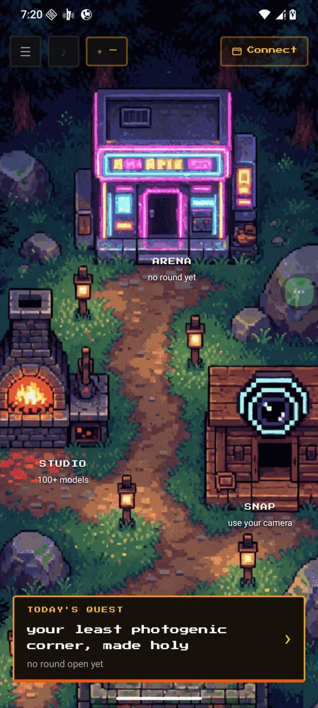
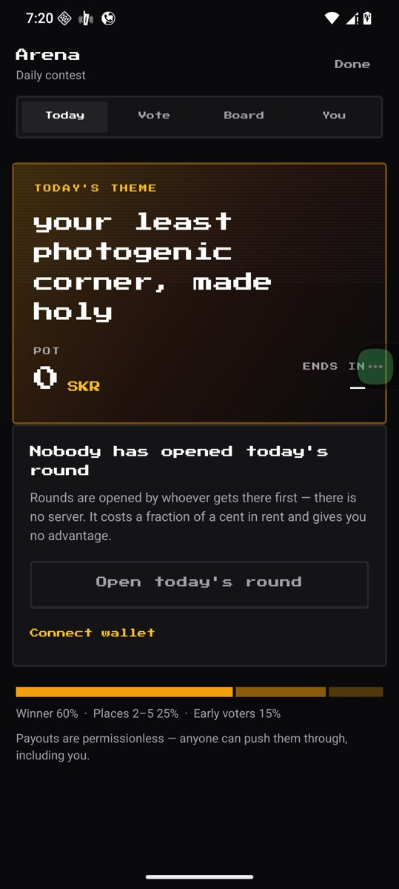
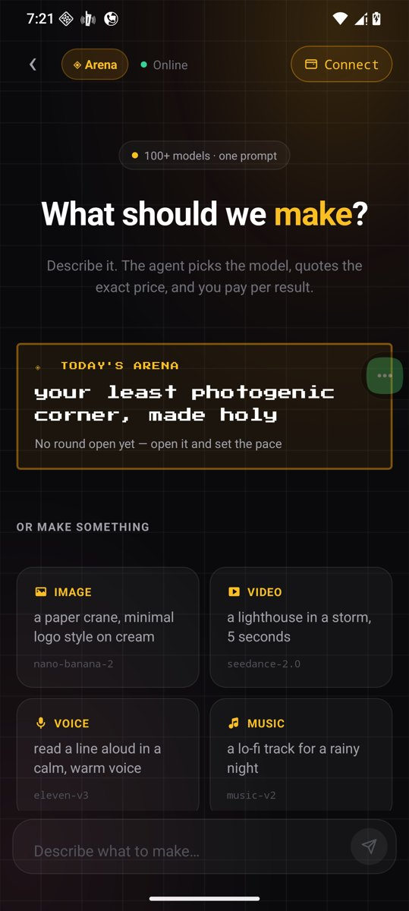
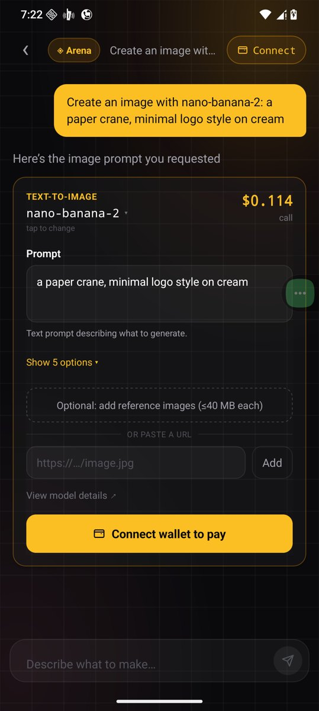

# Device verification

What was run, on what, and what still needs a human.

## The device and the build

| | |
|---|---|
| Device | **Solana Mobile Seeker** (`ro.product.model=Seeker`) |
| OS | Android 16, arm64-v8a |
| Build under test | **1.1.3, versionCode 8** — installed from the published APK, not a dev build |
| Source | `releases/download/v1.1.3/app-release.apk` |
| Signer | the same release key as 1.1.1 and 1.1.2, so it installs over them |

The APK was downloaded from the public release link and installed with
`adb install -r`, so what is screenshotted below is what a judge gets.

```bash
adb shell getprop ro.product.model          # Seeker
adb shell getprop ro.build.version.release  # 16
adb install -r gliana-agent-1.1.3-vc8.apk   # Success
adb shell dumpsys package com.glianalabs.agent | grep version
#   versionCode=8  minSdk=24  targetSdk=36
#   versionName=1.1.3
```

## What ran on the device

| | |
|---|---|
|  | **Cold start to the map.** Fresh install, no wallet, no history. The quest reads today's theme, resolved from the round id with no server call. |
|  | **The Arena.** Today, Vote, Board and You. The pot, the countdown and the split are read from the round account; "nobody has opened today's round" is the honest state before anyone does. |
|  | **The studio.** Today's quest, then four worked examples naming the model each would use. |
|  | **The price, before anything runs.** `nano-banana-2`, **$0.114**, the prompt still editable, and the only button is *Connect wallet to pay*. Nothing has been charged and nothing has been generated. |

That is the quote half of the paid path, on the target hardware, from the
published binary.

## What a screenshot cannot establish

**Signing and settlement need a wallet and real money.** Mobile Wallet Adapter
hands the transaction to Seed Vault, a human approves it, and USDC leaves that
person's wallet. There is no way to automate that honestly — a mocked signer
would prove only that the mock works.

What stands in for it is the chain, which is harder to fake than a screenshot:

| Step | Evidence |
|---|---|
| Entry paid from the phone through Seed Vault | [`36CMJB37…CMwHcGU`](https://explorer.solana.com/tx/36CMJB37exC2o5VmY3gnUwy1H6cgZuEX9nv32zWQSde4LXxHTdyTaXebF8QkdZo37qbHAz7TxmF4ZzuogCMwHcGU) |
| Vote, one per wallet | [`3PBuWvmL…RqhPikhg`](https://explorer.solana.com/tx/3PBuWvmL72YbK8ihWrKTxuqMuNr7SKvTvhxeh86n9LYWsLaZtExcDccoAvW4rabyDLrMqgkjdn4iUbQFRqhPikhg) |
| Payout, pushed by a wallet that did not win | [`3oeJCnCS…ENPpKxJq`](https://explorer.solana.com/tx/3oeJCnCSvrE9RWwyxca1u39RHmA7HcWCr6hRcJ1AZkwCX28Jar6VDRo93k3j1NXUjDqjYCh4xw8YJjwHENPpKxJq) |

The demo video shows the same flow as one uninterrupted take, including the
Seed Vault sheet.

## Reproduce it

```bash
# 1. the published binary, on any Android device
adb install -r app-release.apk

# 2. today's round, as the app resolves it — no wallet needed
cd /path/to/repo && npm run arena:state

# 3. the quote the app shows, from the same endpoint the app calls
curl -s 'https://api.glianalabs.com/v1/price?model=nano-banana-2'

# 4. that an unpaid call is refused rather than served
curl -si -X POST https://api.glianalabs.com/v1/infer \
  -H 'content-type: application/json' \
  -d '{"model":"nano-banana-2","prompt":"a paper crane"}' | head -1
#   HTTP/2 402
```

Steps 2–4 need no phone. Step 4 is the product in one line: the gateway refuses
work it has not been paid for, and the app is a client that answers that refusal
from the user's own wallet.
